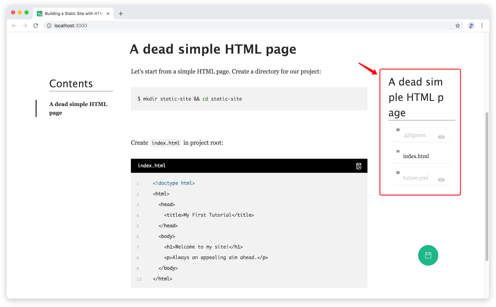
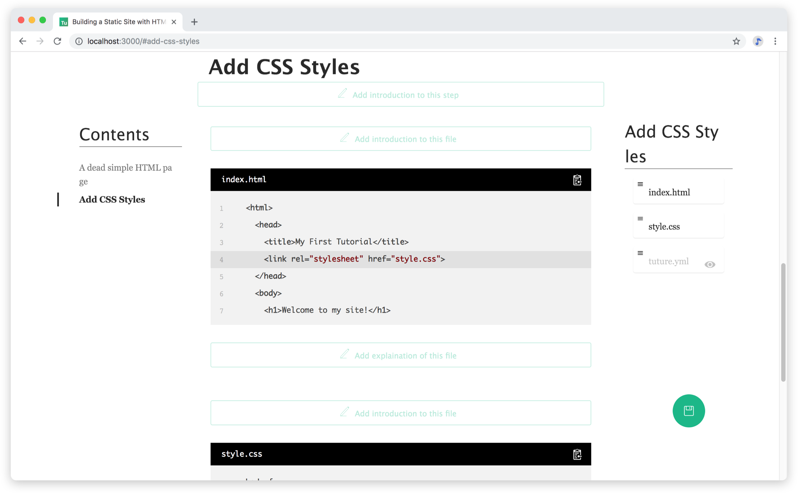

# Start Writing

There are two ways to write Tuture tutorials:

1. **Incremental**: building the project along with explaining
2. **One-off**: finish the project and fill in all explanations

We'll write a tutorial on HTML5 & CSS respectively.

## Incremental

### Initialize

First let's create a new directory for our tutorial, and initialize a Git repo:

```bash
$ mkdir my-awesome-tutorial && cd my-awesome-tutorial
$ git init
```

::: tip
For Windows users, please run all commands in **Git Bash** shipped with Git Windows distributions.
:::

Then we initialize a Tuture tutorial by running `tuture init` and answering following prompts:

```bash
$ tuture init
✔ Tutorial Name … Building a Static Site with HTML and CSS
✔ Topics … html, css
✔  success   tuture.yml is created!
```

::: tip
Refer to [CLI Commands](/reference/cli-commands.md) for usage of all commands.
:::

After initialization, you'll find those new files:

```
.
├── .gitignore
├── .tuture
│   └── diff.json
└── tuture.yml
```

Let's have a look at all of them.

- `.gitignore`, which is quite familiar to Git users. Tuture automatically adds a rule to ignore `.tuture` directory.

- `.tuture/diff.json` is a record of parsed Git diff data for internal use.

- `tuture.yml` is the key file which keeps track of everything about this tutorial:

  ```yaml
  name: Building a Static Site with HTML and CSS
  topics:
    - html
    - css
  steps: []
  ```

  ::: tip
  Refer to [tuture.yml Specification](/reference/tuture-yml-spec.md) for meanings of all fields. Don't worry if you are not okay with YAML syntax, since **we don't edit this file directly when writing**.
  :::

### Code

It's time for writing some real code.

Add `index.html` as below:

```html
<!doctype html>
<html>
  <head>
    <title>My First Tutorial</title>
  </head>
  <body>
    <h1>Welcome to my site!</h1>
    <p>Always an appealing aim ahead.</p>
  </body>
</html>
```

Make the first commit:

```bash
$ git add .
$ git commit -m "A dead simple HTML page"
```

### Explain

Running `tuture up`, and browser editor will pop out:


We can see that tuture has managed the tutorial structure for us and list code diff previously committed.

Let's edit following three places:

1. Short description of our tutorial
2. Introduction and sumup of our first step
3. Introduction and explanation on `index.html`

Press **Edit** button, and you can start editing in the markdown editor. After you are finished, click on **Confirm** button. Now we have our first step:



Within red box on the right is **Step Filelist**, which is a listing of all modified files in this step as the name suggests. If the file name is black (like `index.html` above), then this file will be displayed, or if the file name is greyed out (like `.gitignore` and `tuture.yml`), it'll be  hidden. Click on the "Eye" button to toggle display/hide status.

### Iterate

Let's move on to the next step: Add CSS Styles

Create a `style.css` file:

```css
body {
  background-color: #eee;
  margin: 10%;
}

h1 {
  font-size: 5rem;
  font-family: Arial, Helvetica, sans-serif;
}

p {
  font-size: 2rem;
}
```

Change `index.html` as below:

```html
<!doctype html>
<html>
  <head>
    <title>My First Tutorial</title>
    <link rel="stylesheet" href="style.css">
  </head>
  <body>
    <h1>Welcome to my site!</h1>
    <p>Always an appealing aim ahead.</p>
  </body>
</html>
```

Save and commit:

```bash
$ git add .
$ git commit -m "Add CSS Styles"
```

Back to our browser editor, and you'll find the second step is added by tuture:



We can see that Tuture has marked the code diff of `index.html` quite clear, which enables readers to easily follow and code as they read.

We hope to explain `style.css` before `index.html`. This can be done by Step Filelist mentioned above - drag and drop items to adjust the display order.

After that, let's begin writing explanations on the second step. In the end, we want to add a screenshot of our site by clicking on "Insert Image" button of markdown editor (or simply pasting):


Click on "Preview" tab of markdown editor, and here is our screenshot!


So our radically short tutorial is finished. Click on "Save" button, and enjoy our work!

## One-off

One-off writing is well-suited for following situations:

- Writing tutorials and projects simultaneously hinders your thinking
- You have a working codebase and want to turn it into a tutorial

Enter the project root, initialize Tuture tutorial with `tuture init`. Then execute `tuture up` and you can see the tutorial skeleton generated by Tuture. All you need to do is writing explanation for changes within each step, and your tutorial is completed.
