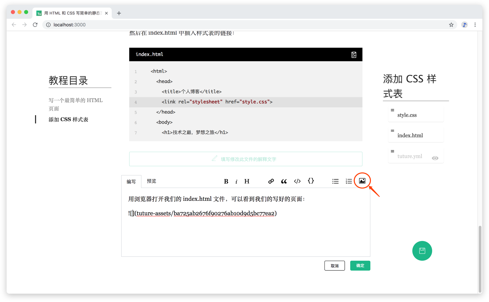

# 开始写作

写 Tuture 教程有两种方式：

1. **渐增式（Incremental)**：边写代码边写讲解
2. **瀑布式（One-off）**：将代码写完后（或者从已有的仓库开始），再写完所有讲解

我们分别用两种方式写一篇 HTML5 & CSS3 教程。

## 渐增式

### 初始化教程

首先我们创建一个目录用于写教程，并初始化 Git 仓库：

```bash
$ mkdir my-awesome-tutorial && cd my-awesome-tutorial
$ git init
```

::: tip 提示
Windows 用户请在 Git 附带的 **Git Bash** 中运行所有命令。
:::

接着我们初始化 Tuture 教程，输入 `tuture init` 命令后，回答一系列关于教程基本信息的问题：

```bash
$ tuture init
✔ Tutorial Name … 用 HTML 和 CSS 写简单的静态页面
✔ Topics … html, css
✔  success   tuture.yml is created!
```

::: tip 提示
关于所有命令的使用方法，参考 [CLI 命令](/zh/reference/cli-commands.md)。
:::

初始化完成后，你会发现原来的目录里多了下面这些东西：

```
.
├── .gitignore
├── .tuture
│   └── diff.json
└── tuture.yml
```

下面分别介绍一下新增加的文件：

- `.gitignore`，这个文件大家都很熟悉了。Tuture 自动添加了忽略 `.tuture` 目录的规则，这里我们再添加一些 Node 项目的规则：

  ```
  .tuture
  node_modules
  ```

- `.tuture/diff.json` 记录了解析后的用于内部使用的 Git Diff 数据，在渲染教程时需要使用到。

- `tuture.yml` 是 Tuture 教程最重要的文件，它记录了关于教程的所有数据，所有讲解文字也是在此文件中：

  ```yaml
  name: 用 HTML5 和 CSS3 写简单的静态页面
  topics:
    - html
    - css
  steps: []
  ```

  ::: tip 提示
  参考 [tuture.yml 详细说明](/zh/reference/tuture-yml-spec.md)以了解所有字段的含义。如果你对 YAML 语法不太熟悉也没有关系，因为在写教程的时候我们**不需要直接编辑此文件**。
  :::

### 编写代码

接下来便是写教程项目的代码了。

我们添加 `index.html`：

```html
<!doctype html>
<html>
  <head>
    <title>个人博客</title>
  </head>
  <body>
    <h1>技术之巅，梦想之旅</h1>
    <p>小若燕“雀”，亦可一展宏“图”。在互联网的世界，只要你有闯荡的激情和热血，无论出身，无论背景，终能一飞冲天，实现自身的理想和价值。</p>
  </body>
</html>
```

提交第一步的代码：

```bash
$ git add .
$ git commit -m "写一个最简单的 HTML 页面"
```

### 填写讲解

运行 `tuture up` 命令，会弹出浏览器编辑页面：


可以看到，tuture 已经帮我们整理好了教程的结构，并且把刚才提交的代码变化罗列了出来。

接下来我们要编辑三处地方：

1. 教程的简介
2. 第一步的介绍文字和总结文字
3. `index.html` 的介绍文字和讲解文字

我们只需点击各个地方的“编写”按钮，就可以在弹出的 Markdown 编辑框中进行编辑了。编辑完成后点击“确定”按钮后，教程的第一步已经写好了：


右边红色的框中是**步骤文件目录**，列出了这一步骤中的所有发生修改的文件。黑色的文件名表示这一文件将在教程中展示（例如上面的 index.html），而灰色的文件名则表示此文件被隐藏（例如 .gitignore 和 tuture.yml）。点击每个文件名框右侧的“眼睛”按钮即可调整显示/隐藏状态。

### 反复迭代

我们开始编写下一步骤：添加 CSS 样式表。

创建 `style.css` 文件如下：

```css
body {
  background-color: #eee;
  margin: 10%;
}

h1 {
  font-size: 5rem;
  font-family: Arial, Helvetica, sans-serif;
}

p {
  font-size: 2rem;
}
```

修改 `index.html` 如下：

```html
<!doctype html>
<html>
  <head>
    <title>我的第一篇教程</title>
    <link rel="stylesheet" href="style.css">
  </head>
  <body>
    <h1>技术之巅，梦想之旅</h1>
    <p>小若燕“雀”，亦可一展宏“图”。在互联网的世界，只要你有闯荡的激情和热血，无论出身，无论背景，终能一飞冲天，实现自身的理想和价值。</p>
  </body>
</html>
```

保存并提交代码：

```bash
$ git add .
$ git commit -m "添加 CSS 样式表"
```

回到浏览器编辑界面，会发现第二步骤已经自动添加了进去：


可以看到 Tuture 为我们把 `index.html` 的变化非常清晰地标注了出来，这能够让阅读教程的读者轻松地跟上你的节奏，边看边亲身实践。

我们希望先讲解 `style.css` 再讲解 `index.html`，这可以通过上面提到的步骤文件目录来调整——通过拖动文件名框来调整展示的顺序。

调整好顺序后，我们继续编写第二步的讲解文字。在第二步的最后，我们希望插入最后写好的页面的展示图片。点击 Markdown 编辑器右上角的“插入图片”按钮，或是直接将图片粘贴到编辑区域中，即可完成图片的插入：



点击 Markdown 编辑器的预览按钮，就能看到我们刚才插入的图片了！


这样我们就完成了一个非常简短的教程。点击右下角的“保存”按钮，就可以欣赏我们的作品了！

## 瀑布式

“一步式”的写作适用于以下情形：

- 你觉得一边写教程一边写项目会阻碍思考
- 你之前已经完成了一个项目，打算把这个项目转换成教程

进入到项目根目录，执行 `tuture init` 命令，初始化 Tuture 教程。然后再执行 `tuture up`，就可以看到 Tuture 生成的教程骨架，你只需对着代码变化写一些讲解文字，一篇教程就完成了。
